<div align="center">

# CHI ATLAS · OPEN WORLD

**THE CITY, AT FULL SCALE**


<a href="LICENSE"></a>
<br/>


</div>

---

<p align="center">
  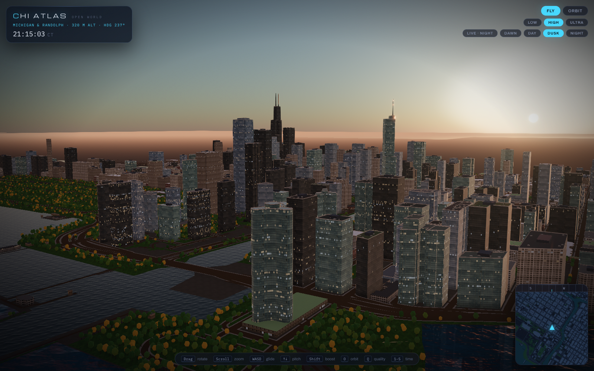
</p>

<p align="center"><em>Dusk over Streeterville. Real footprints at real heights, generated façades, windows lighting up floor by floor as the real Chicago sun goes down.</em></p>

---

## What this is

**An explorable, game-quality Chicago that runs in your browser** — and a new way to plan
a visit, a move, or a job in a city. Fly it like a drone, orbit a tower, drop down the river canyon.

It is the sibling of [CHI ATLAS](https://github.com/AllStreets/chi) — same mission-control HUD
(near-black glass, electric cyan, Chicago red, Michroma / Archivo / IBM Plex Mono) — but the map is
replaced by a full 3D city built from public data, and, in later phases, hand-modelled Blender
landmarks, generated façade textures, live L trains and three guide lenses: **VISIT · LIVE · WORK**.

The world is projected into metres around **State & Madison** — the zero point of Chicago's address
grid — so the HUD always knows which corner you are over.

<table>
<tr>
<td width="50%">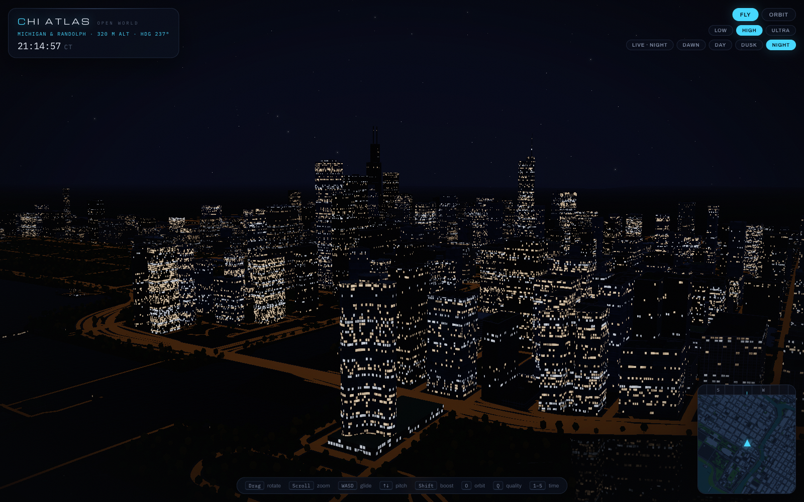</td>
<td width="50%">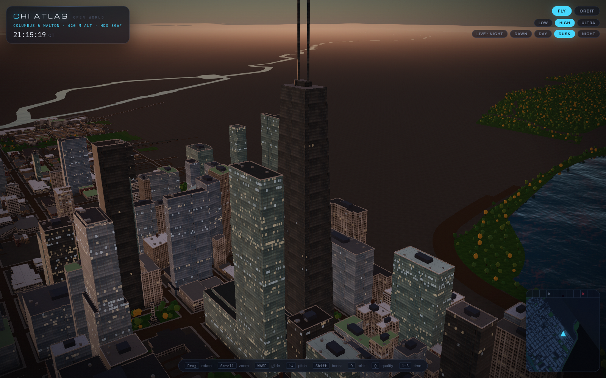</td>
</tr>
<tr>
<td><em>Night — offices light whole floors at a time; the lake carries the reflections.</em></td>
<td><em>875 N Michigan, tapered like the real obelisk, masts on the roof.</em></td>
</tr>
<tr>
<td width="50%">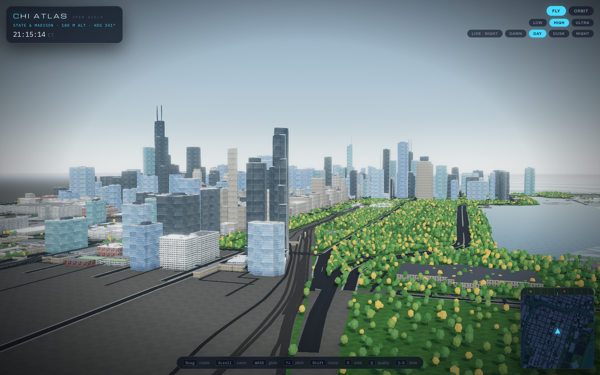</td>
<td width="50%">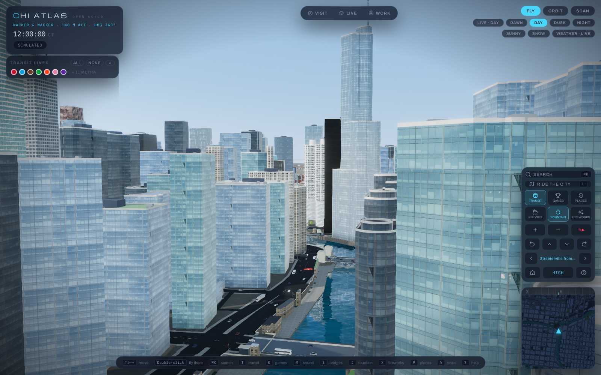</td>
</tr>
<tr>
<td><em>Grant Park in September — the trees follow the real calendar.</em></td>
<td><em>Down the river canyon to Trump Tower, the Riverwalk lined with trees.</em></td>
</tr>
</table>

### The expanded city (Phase 2.5)

<table>
<tr>
<td width="50%">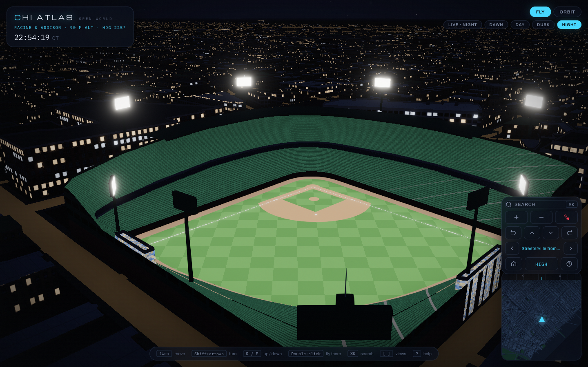</td>
<td width="50%">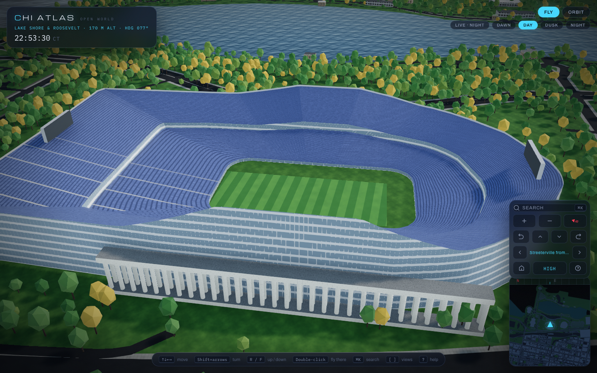</td>
</tr>
<tr>
<td><em>Wrigley under the lights — ivy, the hand-turned scoreboard, the grandstand roof.</em></td>
<td><em>Soldier Field — the bowl rising out of its limestone colonnades.</em></td>
</tr>
<tr>
<td width="50%">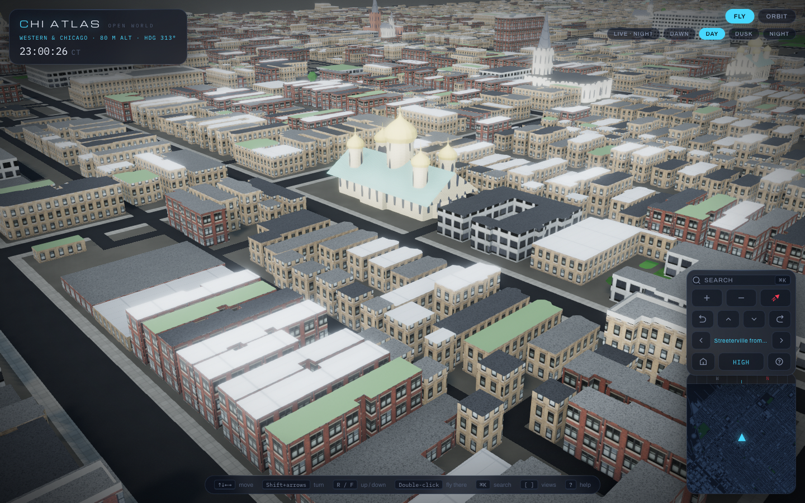</td>
<td width="50%">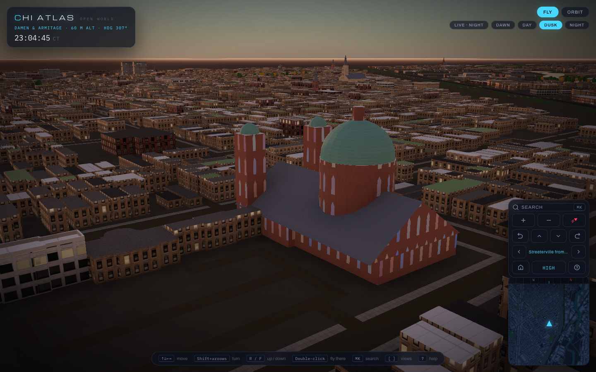</td>
</tr>
<tr>
<td><em>Ukrainian Village — Orthodox cathedrals get their onion domes.</em></td>
<td><em>St. Mary of the Angels, dome and twin towers, stained glass coming on at dusk.</em></td>
</tr>
</table>

- **The whole north–south spine** — Addison (Wrigleyville) to 35th Street, Western Avenue to the lake: 110 km², 105,971 buildings from OpenStreetMap, enriched with City of Chicago data, streamed in 500 m tiles and 2 km far blocks with meshopt compression.
- **A skyline you can check** — the top 50 towers are validated against a curated list on every build (St. Regis, One Chicago, NEMA, 400 Lake Shore included); 41 landmarks are hand-specified — setbacks, crowns, spires, tints.
- **Stadiums** — Wrigley, Rate Field and Soldier Field are built as real venues: raked two-tier bowls, surfaced fields (infield clay, mound, foul lines, yard lines, end zones), light towers, scoreboards, the Wrigley marquee and ivy, Soldier Field's colonnades — and they light up for a night game.
- **Sacred buildings** — about 220 churches, cathedrals, synagogues, temples and a mosque get gabled naves, steepled towers facing the street, onion domes or a dome and minaret, and lancet windows that glow like stained glass at night.
- **Civic icons** — the Centennial Wheel (with its LED rim), Cloud Gate in mirror steel, Buckingham Fountain, Pritzker Pavilion's steel headdress and trellis, the Chicago Theatre sign, the Adler and Shedd domes, the Field Museum's porticos, the 1869 Water Tower.
- **No edge of the world** — beyond the detailed area, 50,000 simple buildings on Chicago's real street grid carry the city to the horizon, with suburbs beyond the city limits.
- **Human controls** — ⌘K search with fly-over flights, arrow keys, on-screen control dock, views you can step through, help card; the whole HUD scales together on any window size.

### The beauty pass

- **Façades** — eight Chicago façade families (Loop limestone, art deco, prewar brick, curtain glass, precast, River North loft, three-flat, industrial) generated with Z-Image, cropped to whole window bays by autocorrelation and made seamless. Glass reflects the live sky; every tower gets its own tint.
- **Night** — windows light by office floor, warm and cool, per-building occupancy; bloom, a navy sky with stars, amber street light on the roads.
- **Sky** — follows real Chicago time on load (`LIVE · DUSK`), with DAWN / DAY / DUSK / NIGHT overrides that tween over 2.5 s.
- **Rooftops** — parapets, gravel / tar / white-membrane / green roofs, 120 water towers on prewar lofts, 2,440 HVAC units, 329 mechanical penthouses.
- **Ground** — parks, beaches, Lake Shore Drive and the street grid with sidewalks, the elevated Loop L on steel bents, and 28,862 trees coloured by the current month.
- **Landmarks** — Willis's antennas at their real 527 m; Hancock tapered with its masts reseated on the roof.
- **HUD** — heading-up minimap with a compass strip and click-to-fly, a cinematic intro flight from the lake, LOW / HIGH / ULTRA quality with auto-downgrade.

---

## How it came together

A progressive gallery, oldest first. Images are never replaced — each phase adds its own shots, so you can watch the city grow from flat boxes to a living place.

### Phase 1 · Foundation — *real footprints, real heights, flat colour*

<table>
<tr>
<td width="33%">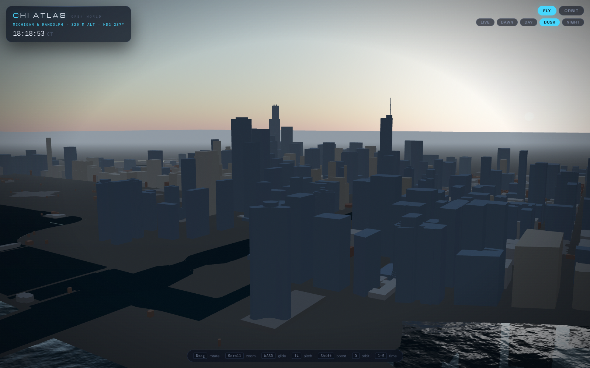</td>
<td width="33%">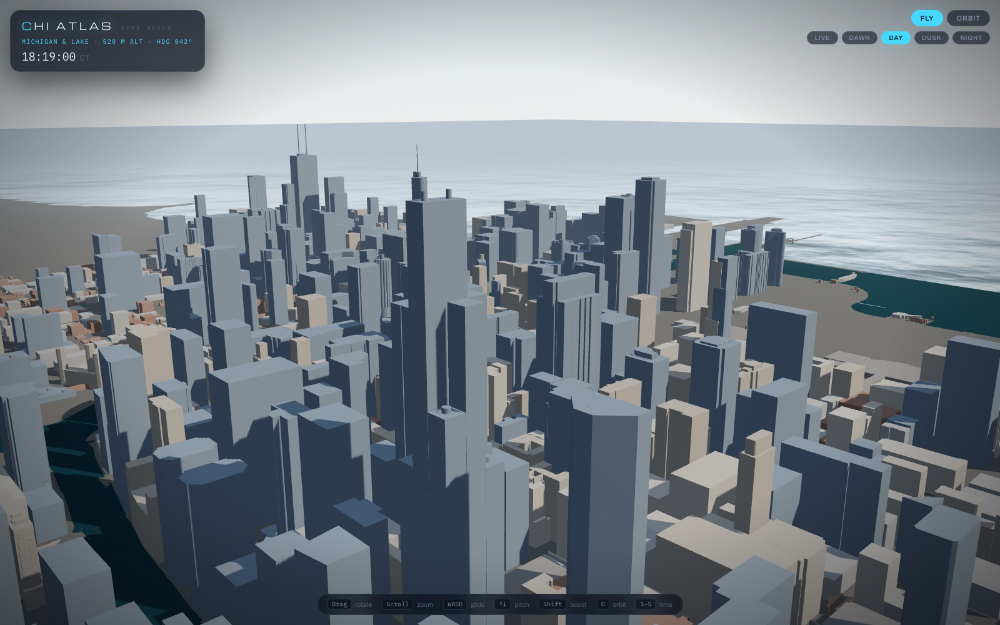</td>
<td width="33%">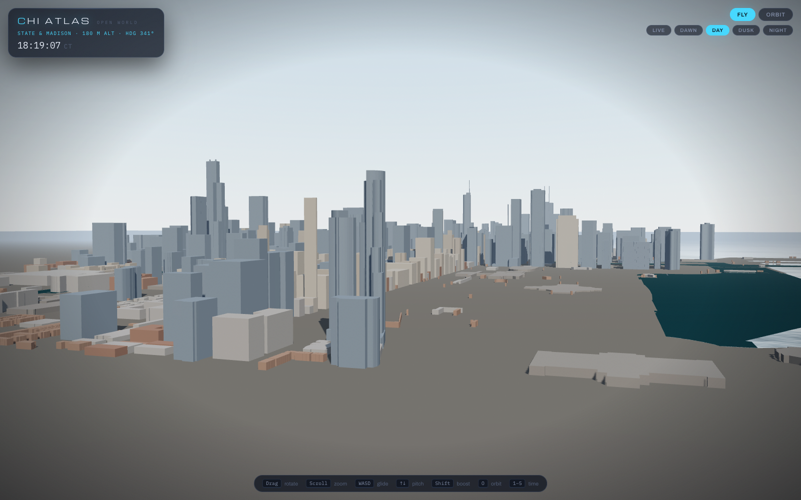</td>
</tr>
<tr>
<td><em>The first frame: City of Chicago footprints extruded to their heights, a physical sky, the lake.</em></td>
<td><em>The Loop — every building present, none of them dressed yet.</em></td>
<td><em>Museum Campus and the skyline from the lake.</em></td>
</tr>
</table>

### Phase 2 · Beauty pass — *façades, light, seasons*

<table>
<tr>
<td width="50%">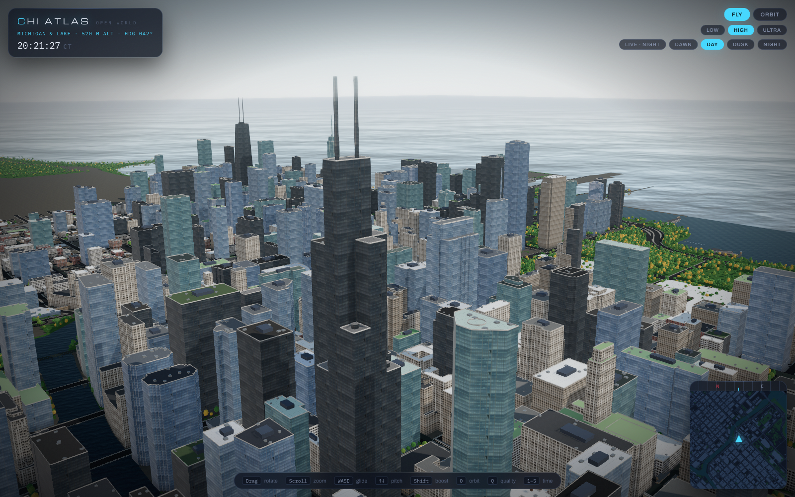</td>
<td width="50%"></td>
</tr>
<tr>
<td><em>Generated façade families, glass that reflects the sky, rooftops with water towers.</em></td>
<td><em>The same dusk pose as Phase 1 — windows now light floor by floor.</em></td>
</tr>
</table>

### Phase 2.5 · Expanded city — *Wrigleyville to 35th Street, a verified skyline*

<table>
<tr>
<td width="50%">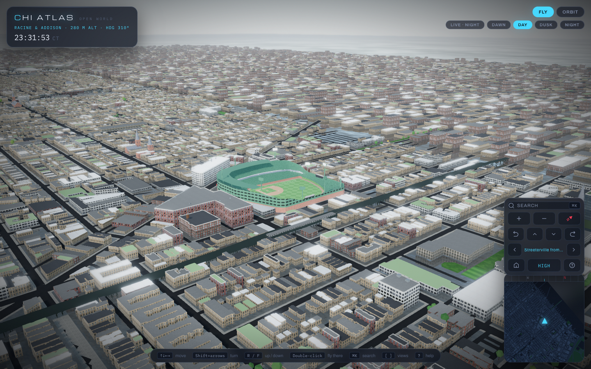</td>
<td width="50%">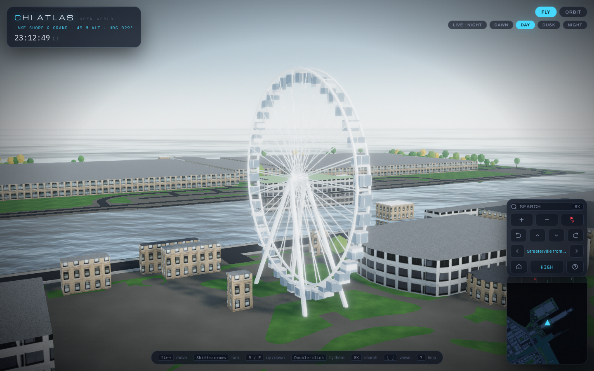</td>
</tr>
<tr>
<td><em>From the Loop to the neighbourhoods: 105,971 buildings, Wrigley built as a real ballpark.</em></td>
<td><em>Civic icons arrive — the Centennial Wheel with its LED rim, the Bean, Buckingham Fountain.</em></td>
</tr>
</table>

### Next · Vision pass — *one lake, living transit, game nights*

Planned in [the master plan](docs/superpowers/plans/2026-09-29-vision-master-plan.md): a single continuous lake and river, CTA lines in their true colours with a restrained neon glow and accurate trains running on them, stadiums with crowds and game nights (and the W flag when the Cubs win), detailed bridges and landmarks, and each tower in its real colours. Its images will be added here as each milestone lands.

## Quickstart

```bash
git clone https://github.com/AllStreets/Chicago-Open-World.git
cd Chicago-Open-World
npm install --prefix pipeline && npm install --prefix app

npm run fetch          # download footprints, boundary and OSM data (cached)
npm run textures       # process generated façades + procedural ground textures
npm run build:world    # build tiles + ground into app/public/world
npm run dev            # http://localhost:5173
```

The generated world is committed, so `npm run dev` works straight after install.
Everything is reachable with the keyboard, the mouse and the on-screen dock — `?view=` / `?time=` URL parameters exist only for tests and screenshots.

## Controls

| Input | Action |
|---|---|
| `⌘K` / `Ctrl+K` / `/` | search any landmark, neighbourhood or view — Enter flies you there |
| `↑` `↓` `←` `→` or `W` `A` `S` `D` | glide over the city (`Shift` for faster) |
| `Shift` + arrows | turn and tilt (`Q` / `E` turn too) |
| `R` / `F` or `Page Up` / `Page Down` | rise and descend |
| Scroll or `+` / `−` | zoom toward the cursor |
| Drag | turn and tilt |
| Double-click | fly to that spot |
| `[` / `]` | previous / next view |
| `H` · `N` · `O` | home · face north · slow orbit |
| `1`–`5` | LIVE · DAWN · DAY · DUSK · NIGHT |
| `?` · `Esc` | help card · close / stop a flight |
| Control dock & minimap | the same moves as buttons; click the minimap to fly |

## Under the hood

```
shared/project.js     one projection, used by pipeline and app
pipeline/             build-time Node — fetch → project → extrude → classify → tile → .glb
app/                  Vite · React 19 · React Three Fiber · zustand
  src/world/          city tiles, land, river, Lake Michigan, physical sky
  src/camera/         Atlas camera rig
  src/hud/            CHI ATLAS HUD — wordmark, readout, pills, hints, loading
```

```bash
npm test                          # pipeline + app unit tests (Vitest)
npm run e2e --prefix app          # hero-view screenshot baselines (Playwright)
```

## Data

- **City of Chicago Data Portal** — Building Footprints (`syp8-uezg`), City Boundary (`qqq8-j68g`).
- **OpenStreetMap** — building heights, `building:part` setbacks, water, parks, roads, rail, street trees.
  © OpenStreetMap contributors, available under the [ODbL](https://www.openstreetmap.org/copyright).

## Roadmap

- [x] **1 · Foundation** — real footprints and heights, land, river, lake, sky, Atlas camera, HUD shell
- [x] **2 · Beauty pass** — generated façades, lit windows, living sky, rooftops, parks & trees, the L, post-processing, minimap, intro flight
- [x] **2.5 · Expanded city** — Wrigleyville → 35th St, verified top-50 skyline, 41 landmarks, stadiums, sacred buildings, civic icons, horizon fill, streaming, human-first controls
- [ ] **Vision pass** — unified lake & river, CTA lines in true colours with glow + running trains, stadium game nights & crowds, detailed bridges & landmarks, true building colours, camera clearance
- [ ] **3 · Heroes** — Blender refinement of the procedural landmarks (Aqua's waves, Marina City's petals, …)
- [ ] **4 · Guide** — VISIT / LIVE / WORK lenses: places (bars, restaurants, venues), neighbourhoods, jobs, tours
- [ ] **5 · Alive** — live L trains and weather via the CHI ATLAS API, Scan mode
- [ ] **6 · Further rings** — streaming the rest of the city
- [ ] **7 · Traversal** — glide mode

Design spec: [docs/superpowers/specs/2026-09-28-chi-atlas-open-world-design.md](docs/superpowers/specs/2026-09-28-chi-atlas-open-world-design.md)

---

<div align="center">

**MIT** © 2026 [Connor Evans](https://github.com/AllStreets)

<sub>Four stars on the flag. Every building on the map.</sub>

</div>
